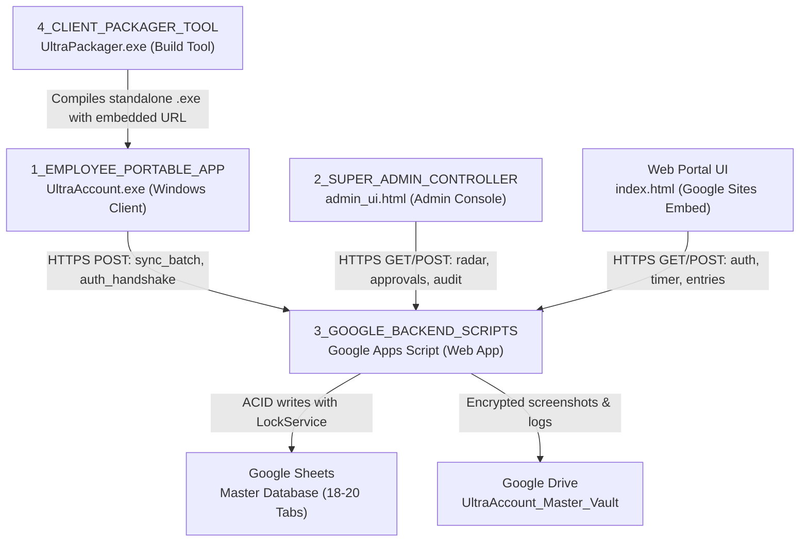

# FLINK Time & Workforce Platform (Ultra-Account)

Enterprise-grade time tracking, workforce monitoring, and audit-compliant timesheet management backed by Google Sheets and Google Drive Master Vault.

---

## Architecture Overview

---

## Directory Structure

| Folder | Component | Description |
|---|---|---|
| [`1_EMPLOYEE_PORTABLE_APP/`](file:///d:/projects-antigravity/FLINK-time/RELEASE_PACKAGE/1_EMPLOYEE_PORTABLE_APP/) | **Employee Portable Tracker** | Standalone zero-dependency Windows desktop tracker (`UltraAccount.exe`). Captures active window, logs time entries, and syncs screenshots. Reads `workspace.json`. |
| [`2_SUPER_ADMIN_CONTROLLER/`](file:///d:/projects-antigravity/FLINK-time/RELEASE_PACKAGE/2_SUPER_ADMIN_CONTROLLER/) | **Super Admin Controller** | Real-time monitoring dashboard (`admin_ui.html`). Live workforce radar, timesheet approvals, screenshots viewer, analytics charts, disaster recovery, and policy configuration. |
| [`3_GOOGLE_BACKEND_SCRIPTS/`](file:///d:/projects-antigravity/FLINK-time/RELEASE_PACKAGE/3_GOOGLE_BACKEND_SCRIPTS/) | **Google Backend Scripts** | Complete serverless Google Apps Script backend (`App.gs`, `Code.gs`, services, and schemas). Hosts the Web App API, database CRUD, and Vault storage. |
| [`4_CLIENT_PACKAGER_TOOL/`](file:///d:/projects-antigravity/FLINK-time/RELEASE_PACKAGE/4_CLIENT_PACKAGER_TOOL/) | **Client Packager Tool** | Utility (`UltraPackager.exe`) to compile custom, pre-configured `UltraAccount.exe` executables with embedded organization backend URLs. |

---

## 5-Minute Quick Start

### 1. Deploy the Google Backend
1. Create a new Google Sheet at [sheets.new](https://sheets.new) named `FLINK_Time_Master_Control`.
2. Open **Extensions** > **Apps Script**.
3. Copy all `.gs` and `.html` files from [`3_GOOGLE_BACKEND_SCRIPTS/`](file:///d:/projects-antigravity/FLINK-time/RELEASE_PACKAGE/3_GOOGLE_BACKEND_SCRIPTS/) into the editor.
4. Enable the manifest in Project Settings and paste [`appsscript.json`](file:///d:/projects-antigravity/FLINK-time/RELEASE_PACKAGE/3_GOOGLE_BACKEND_SCRIPTS/appsscript.json).
5. Select `setupDatabase` from the function dropdown and click **Run** to generate all relational tabs.
6. Click **Deploy** > **New deployment** > **Web app** (`Execute as: Me`, `Who has access: Anyone`).
7. Copy the deployed Web App URL (ends in `/exec`).

### 2. Configure & Run
- **For Employees**: In `1_EMPLOYEE_PORTABLE_APP/workspace.json`, paste your Web App URL into `"backend_url"`. Employees launch `UltraAccount.exe` or `Launch_Portable_Tracker.bat`.
- **For Admins**: Launch `2_SUPER_ADMIN_CONTROLLER/Launch_Admin_Controller.bat` and enter your Web App URL, or open `<YOUR_WEB_APP_URL>?view=admin` directly in your browser.
- **For Google Sites**: Embed `<YOUR_WEB_APP_URL>` directly into your organization's Google Site.

Detailed instructions are available in [`RELEASE_PACKAGE/3_GOOGLE_BACKEND_SCRIPTS/SETUP_INSTRUCTIONS.txt`](file:///d:/projects-antigravity/FLINK-time/RELEASE_PACKAGE/3_GOOGLE_BACKEND_SCRIPTS/SETUP_INSTRUCTIONS.txt).
